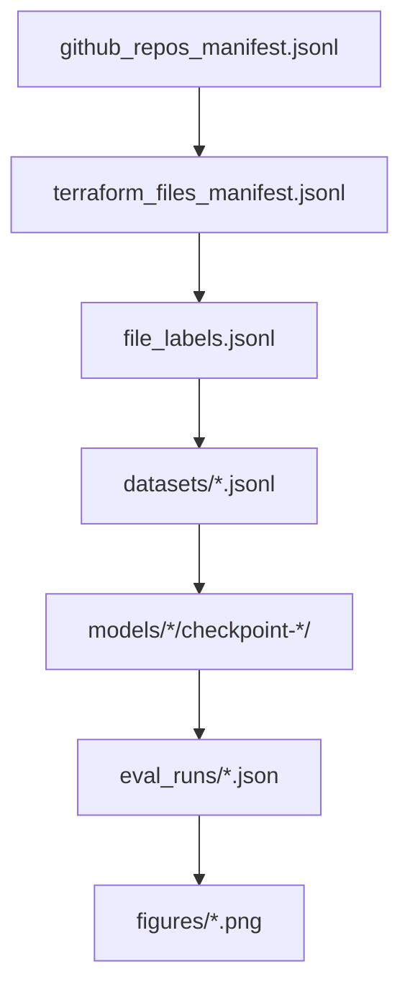

# Axon InfraLinter – Artifacts

This document describes the key data files, model checkpoints, and figures produced by the Axon InfraLinter pipeline.

## Data Artifacts

### `data/github_repos_manifest.jsonl`

**Purpose**: Repository metadata and clone status from GitHub scraping phase.

**Schema**: One JSON object per repository with fields:
- `full_name`: Repository full name (e.g., "owner/repo")
- `clone_url`: HTTPS clone URL
- `default_branch`: Default branch name
- `stars`: Number of GitHub stars
- `cloned_path`: Local path where repo was cloned (or null if clone failed)
- `clone_ok`: Boolean indicating successful clone
- `error`: Error message if clone failed

**Produced by**: `axon_infralinter/data/github_scraper.py`

**Consumed by**: `axon_infralinter/data/terraform_collector.py` to know which repos to process

---

### `data/terraform_files_manifest.jsonl`

**Purpose**: Metadata for each Terraform file extracted from repositories.

**Schema**: One JSON object per `.tf` file with fields:
- `repo_full_name`: Source repository name
- `repo_path`: Local path to cloned repository
- `relative_path`: Path relative to repository root
- `corpus_path`: Path in the flat `data/terraform_files/` corpus
- `size_bytes`: File size in bytes

**Produced by**: `axon_infralinter/data/terraform_collector.py`

**Used for**: Tracing findings back to original repositories, understanding corpus composition

---

### `data/file_labels.jsonl`

**Purpose**: Security labels for each Terraform file based on rule-based scanner findings.

**Schema**: One JSON object per file with fields:
- `corpus_path`: Path to Terraform file in corpus
- `secure`: Boolean - `True` if no HIGH/CRITICAL findings, `False` otherwise
- `tool_findings`: Dictionary with keys `checkov` and `tfsec`, each containing lists of Finding objects

**Finding object schema**:
- `tool`: "checkov" or "tfsec"
- `rule_id`: Scanner-specific rule identifier
- `severity`: "LOW", "MEDIUM", "HIGH", or "CRITICAL"
- `message`: Human-readable description
- `file_path`: Path to file
- `start_line`: Line number where issue was detected (optional)

**Produced by**: `axon_infralinter/scanning/scanner.py`

**Consumed by**: `axon_infralinter/dataset/build_dataset.py` to create training splits

**Labeling rule**: A file is marked `secure=False` if **any** HIGH or CRITICAL finding exists from **either** Checkov or tfsec.

---

### `data/datasets/train.jsonl`, `val.jsonl`, `test.jsonl`

**Purpose**: Balanced train/validation/test splits for model training and evaluation.

**Schema**: One JSON object per example with fields:
- `input_text`: Prompt + Terraform file content
- `target_text`: Expected model output ("SECURE\n..." or "INSECURE\n...")
- `secure`: Boolean label
- `corpus_path`: Path to original Terraform file
- `tool_findings`: Original scanner findings (for reference)

**Produced by**: `axon_infralinter/dataset/build_dataset.py`

**Consumed by**: `axon_infralinter/models/train_lora.py` (train/val) and `axon_infralinter/models/evaluate.py` (test)

**Split ratios**: 70% train, 15% validation, 15% test (configurable in `config.py`)

**Balancing**: Equal numbers of secure and insecure examples per split (up to `TARGET_NUM_FILES` total)

---

### `data/eval_runs/*.json`

**Purpose**: Raw evaluation results from model evaluation runs.

**File naming**: `eval_axon_lora_codellama_run{N}_{timestamp}.json`

**Schema**: JSON object with fields:
- `model`: Model identifier
- `run_id`: Run number/seed
- `timestamp`: ISO timestamp
- `metrics`: Dictionary with `accuracy`, `precision`, `recall`, `f1`
- `predictions`: List of (true_label, predicted_label) pairs
- `runtime_seconds`: Total evaluation time

**Produced by**: `axon_infralinter/models/evaluate.py`

**Consumed by**: `axon_infralinter/models/visualize_benchmarks.py` to generate figures

---

### `data/eval_runs/summary_*.json`

**Purpose**: Aggregated metrics across multiple evaluation runs.

**Files**:
- `summary_all_models.json`: Comparison across all models (LLM, Checkov, tfsec)
- `summary_codellama.json`: Statistics for CodeLlama runs only
- `summary_stable_code.json`: Statistics for StableCode runs (if applicable)

**Schema**: Dictionary mapping model names to lists of metric dictionaries (one per run)

**Produced by**: Aggregation scripts or manual post-processing

---

### `data/DELETION_STATUS.md`, `data/DELETION_SUMMARY.md`

**Purpose**: Documentation of cleanup operations and space savings.

**Content**: Records which large directories were deleted (e.g., `data/repos/`, `data/scans/`) and why, plus estimated space freed.

**Status**: Historical documentation - not required for runtime

---

### `data/terraform_files.zip`

**Purpose**: Compressed archive of the extracted Terraform corpus.

**Status**: **Archive artifact** - useful as a portable backup but not required for runtime

**Recommendation**: Move to `archive/` directory to clearly mark as non-runtime

---

## Model Artifacts

### `models/axon_lora_codellama/`

**Purpose**: Fine-tuned LoRA adapter weights and configuration for CodeLlama.

**Contents**:
- `adapter_config.json`: LoRA configuration (rank, alpha, target modules)
- `adapter_model.safetensors`: LoRA adapter weights
- `tokenizer_config.json`, `tokenizer.json`: Tokenizer configuration
- `special_tokens_map.json`: Special token mappings
- `training_args.bin`: Hugging Face training arguments (for reproducibility)
- `chat_template.jinja`: Chat template for instruction formatting

**Produced by**: `axon_infralinter/models/train_lora.py`

**Consumed by**: `axon_infralinter/models/evaluate.py` and `axon_infralinter/cli/axon_infralinter_cli.py`

---

### `models/axon_lora_codellama/checkpoint-*/`

**Purpose**: Training checkpoints with full Trainer state.

**Contents** (per checkpoint directory):
- `adapter_model.safetensors`: Adapter weights at this checkpoint
- `adapter_config.json`: LoRA configuration
- `trainer_state.json`: Training history (losses, steps, best metrics)
- `optimizer.pt`, `scheduler.pt`: Optimizer and learning rate scheduler state
- `rng_state.pth`: Random number generator state (for exact reproducibility)
- `training_args.bin`: Training arguments

**Produced by**: Hugging Face Trainer during `train_lora.py` execution

**Used for**: Resuming training, selecting best checkpoint for evaluation

**Best checkpoint selection**: Typically the checkpoint with lowest `eval_loss` in `trainer_state.json`

---

### `models/axon_lora/`

**Purpose**: Alternative/additional LoRA adapter directory (may be from earlier experiments).

**Status**: Check if this is still needed or can be archived

---

## Figure Artifacts

### `figures/f1_boxplot.png`

**Purpose**: Visualize F1 score distributions across models and/or random seeds.

**Generated by**: `axon_infralinter/models/visualize_benchmarks.py`

**Shows**: Box plots comparing F1 scores for LLM vs. rule-based scanners, with variance across runs

---

### `figures/metrics_comparison.png`

**Purpose**: Side-by-side comparison of all classification metrics.

**Generated by**: `axon_infralinter/models/visualize_benchmarks.py`

**Shows**: Bar charts or grouped comparisons of accuracy, precision, recall, and F1 for:
- Fine-tuned LLM
- Checkov baseline
- tfsec baseline

---

### `figures/runtime_comparison.png`

**Purpose**: Compare inference/runtime costs between approaches.

**Generated by**: `axon_infralinter/models/visualize_benchmarks.py`

**Shows**: Runtime per file or total evaluation time, highlighting the tradeoff between LLM accuracy and computational cost

---

## Artifact Dependencies

