# Axon InfraLinter – System Overview

## Purpose

Axon InfraLinter is a research prototype that uses a fine-tuned code LLM
to detect security misconfigurations in Terraform Infrastructure-as-Code
and compare performance against rule-based scanners (Checkov, tfsec).

## High-level Pipeline

1. **GitHub repo discovery and cloning** - Search GitHub for repositories containing Terraform code and clone them locally
2. **Terraform file extraction** - Extract all `.tf` files from cloned repos into a flat corpus directory
3. **Security scanning** - Run Checkov and tfsec on each file and aggregate findings into unified labels
4. **Dataset building** - Create balanced train/val/test splits with equal secure/insecure examples
5. **LLM fine-tuning** - Fine-tune CodeLlama with LoRA adapters on the labeled dataset
6. **Model evaluation** - Compare LLM performance against rule-based scanners on held-out test set
7. **CLI inference** - Provide a simple command-line interface to analyze new Terraform files

## File Map

| Area                 | Path                                      | Documentation                          |
|----------------------|-------------------------------------------|----------------------------------------|
| GitHub scraping      | `axon_infralinter/data/github_scraper.py` | `docs/modules/axon_data.md`            |
| TF collection        | `axon_infralinter/data/terraform_collector.py` | `docs/modules/axon_data.md`         |
| Scanning             | `axon_infralinter/scanning/scanner.py`    | `docs/modules/axon_scanning.md`        |
| Dataset building     | `axon_infralinter/dataset/build_dataset.py` | `docs/modules/axon_dataset.md`      |
| Training/eval        | `axon_infralinter/models/*.py`            | `docs/modules/axon_models.md`          |
| CLI                  | `axon_infralinter/cli/axon_infralinter_cli.py` | `docs/modules/axon_cli.md`          |
| Top-level scripts    | `check_checkpoints.py`, `install_scanners.sh` | `docs/scripts/*.md`                |
| Data artifacts       | `data/*`                                  | `docs/artifacts.md`                   |
| Models & checkpoints | `models/*`                                | `docs/artifacts.md`                   |
| Figures              | `figures/*.png`                           | `docs/artifacts.md`                   |

## End-to-End Pipeline Diagram

```mermaid
flowchart LR
    githubScraper["data/github_scraper.py"]
    tfCollector["data/terraform_collector.py"]
    scanner["scanning/scanner.py"]
    buildDataset["dataset/build_dataset.py"]
    trainLora["models/train_lora.py"]
    evaluate["models/evaluate.py"]
    cli["cli/axon_infralinter_cli.py"]

    githubScraper --> tfCollector --> scanner --> buildDataset --> trainLora --> evaluate --> cli
```

## Key Design Decisions

- **Flat corpus structure**: Terraform files are extracted into a single directory with unique names, decoupling scanning from git repository structure
- **Unified label format**: Findings from multiple scanners (Checkov, tfsec) are normalized into a common structure for consistent evaluation
- **Balanced dataset**: Equal numbers of secure and insecure examples prevent class imbalance from dominating model performance
- **LoRA fine-tuning**: Parameter-efficient fine-tuning allows adapting large models with limited GPU memory
- **Reproducible evaluation**: Fixed random seeds and comprehensive logging enable fair comparison across model variants

